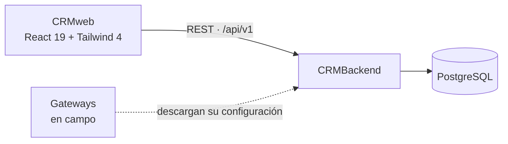

<div align="center">

# 🗂️ CRMweb

### El panel del operador: clientes, sedes, gateways, medidores y sus variables

[](https://react.dev/)
[](https://www.typescriptlang.org/)
[](https://tailwindcss.com/)
[](tests/)

[Qué hace](#qué-hace) •
[Instalación](#instalación) •
[Pantallas](#pantallas) •
[Estructura](#estructura-del-proyecto) •
[Tests](#tests)

</div>

---

## Tabla de Contenidos

- [Qué hace](#qué-hace)
- [Arquitectura](#arquitectura)
- [Requisitos](#requisitos)
- [Instalación](#instalación)
- [Pantallas](#pantallas)
- [Roles](#roles)
- [Estructura del proyecto](#estructura-del-proyecto)
- [Tema](#tema)
- [Tests](#tests)
- [Límites conocidos](#límites-conocidos)
- [Troubleshooting](#troubleshooting)

---

## Qué hace

CRMweb es la web que abre **el operador**, no el cliente. Da de alta la
instalación —empresa, sede, gateway, medidor, variables— y administra lo que
la plataforma comparte con toda la flota.

| | |
|---|---|
| 🏢 **El árbol de la instalación** | Cliente → sede → gateway → equipo → variable, navegable por URL |
| 📡 **Flota** | Todos los gateways de plano, con los caídos primero |
| 🔧 **Configuración del firmware** | Lo que el gateway descarga, y si ya lo aplicó |
| 🔑 **Credenciales** | Del gateway, de servicios que consumen la API, y el comando de instalación |
| ⚙️ **Configuración de la flota** | Las variables del `.env` que comparten todos los equipos |

---

## Arquitectura



Organizado **por feature, no por tipo de archivo**: agregar un recurso es crear
una carpeta.

Dos reglas sostienen eso:

- **`src/api/` es la única capa que conoce rutas HTTP.** Ningún componente ni
  contexto arma una URL, y las funciones devuelven el tipo concreto
  (`Promise<Page<Client>>`), nunca `AxiosResponse`.
- **`src/api/types.ts` es el espejo del backend.** Si el backend cambia un
  campo, se corrige ahí y el compilador marca todo lo demás.

---

## Requisitos

| | |
|---|---|
| Node | 20 o superior |
| CRMBackend | corriendo, con un usuario administrador creado |

---

## Instalación

```bash
npm install
cp .env.example .env      # PUBLIC_API_BASE_URL
npm run dev
```

Y el backend, en otra terminal:

```bash
cd ../CRMBackend
uv run uvicorn app.main:create_app --factory --reload
uv run python -m app.scripts.create_admin     # el primer usuario
```

> ⚠️ **El backend arranca con `CORS_ORIGINS` vacío**, así que el navegador
> bloquea todas las llamadas desde el servidor de desarrollo. En el `.env` del
> backend, sin comillas y con el puerto real:
>
> ```
> CORS_ORIGINS=http://localhost:3000
> ```

| Comando | Qué hace |
|---|---|
| `npm run dev` | Servidor de desarrollo |
| `npm run build` | Typecheck y después el paquete de producción |
| `npm run typecheck` | `tsc --noEmit` sobre `src/` y `tests/` |
| `npm test` | Las pruebas |
| `npm run format` | Prettier |

---

## Pantallas

Las URLs reflejan la jerarquía, así que la miga de pan y el enlace compartido
dicen lo mismo:

```
/clients/:clientId/sites/:siteId/gateways/:gatewayId/equipment/:equipmentId
```

Cada nivel carga su entidad **una sola vez** y se la pasa a sus hijos. Una
pantalla profunda nunca vuelve a pedir sus ancestros.

| Ruta | Qué muestra |
|---|---|
| `/clients` | Las empresas, y el árbol completo bajo cada una |
| `/gateways` | Toda la flota de plano, con los caídos primero |
| `/tariffs` | Tarifas |
| `/users` | Cuentas del CRM — solo `admin` |
| `/service-accounts` | Credenciales de otros sistemas, y la configuración de la flota |

### Lo que conviene saber antes de tocar un gateway

**La descarga de configuración arranca apagada.** Hasta encenderla, el gateway
recibe 403 al pedir su configuración. El interruptor vive en el panel de
Configuración, que es donde se explica qué hace.

**El ciclo se cierra solo**: el gateway descarga, escribe y acusa recibo, y ese
acuse apaga el interruptor. Todo lo que edites después queda sin entregar hasta
que lo vuelvas a encender — y nada falla mientras tanto. Esa pantalla es lo
único que lo dice.

**`estado` no se edita.** Se deriva de `ultima_conexion` con un umbral que vive
en el backend, así que el indicador dice la verdad en vez de lo que alguien
tipeó al instalar.

---

## Roles

| Rol | Lee | Escribe | `/users` |
|---|---|---|---|
| `admin` | toda la plataforma | sí | sí |
| `tecnico` | toda la plataforma | sí | no |
| `solo_lectura` | toda la plataforma | no | no |

El rol `cliente` **no entra acá**: `/auth/login` lo rechaza con el mismo 401
genérico que una contraseña incorrecta. Su lugar es EMS Monitor, con su propia
superficie de autenticación.

La UI oculta lo que un rol no puede hacer, pero igual maneja el 403 del
servidor: **la UI es conveniencia, el backend es la autoridad.**

---

## Estructura del proyecto

```
src/
├── api/          Una instancia de axios, los tipos del contrato,
│                 un archivo por recurso
├── context/      Auth, Toast, Theme
├── hooks/        useAuth, useToast, usePaginatedResource, useResourceForm…
├── components/
│   ├── ui/         Button, Input, Select, Table, Drawer…
│   ├── layout/     AppShell, Sidebar, Topbar, Breadcrumbs
│   └── guards/     ProtectedRoute, RoleGate
├── features/     auth · clients · sites · gateways · equipment ·
│                 variables · tariffs · users · services · fleet
├── routes/       El router
├── lib/          permissions, formatters, errors
└── styles/       theme.css — el @theme de Tailwind 4
```

### Sesión

`src/api/http.ts` tiene una sola instancia de axios. Ante un 401 intenta **una
vez** `POST /auth/refresh` y reintenta la petición original; las peticiones
concurrentes se encolan detrás del mismo refresh, así que N respuestas 401
disparan un solo refresh.

Todo error sale normalizado como `ApiError` — la UI nunca parsea una respuesta
cruda.

Los tokens se guardan en `localStorage`, que es vulnerable a XSS. La
alternativa es una cookie `httpOnly`, y eso requiere cambios en el backend.

---

## Tema

Tailwind 4 es CSS-first: **no hay `tailwind.config.js`**. `src/styles/theme.css`
define las escalas en `@theme` y los tokens semánticos en `@theme inline`,
apuntando a variables que cambian con `.dark`.

Claro, oscuro o según el sistema, persistido en `localStorage`.

---

## Tests

```bash
npm test
```

129 pruebas, sobre lo que puede romperse **en silencio**: el interceptor de
refresh y sus peticiones concurrentes, el mapeo de errores 422 al input
correcto, la tabla de roles completa, y que un secreto se muestre una sola vez
y no quede en el DOM.

---

## Límites conocidos

| | |
|---|---|
| El buscador de clientes filtra en el navegador | `/clients` todavía no acepta `search` |
| El orden por columna ordena la página cargada | El backend no acepta `order_by` |
| La flota no dice si un gateway tiene cambios sin entregar | Pedirlo por fila sería una petición por gateway. El aviso completo está en el detalle |
| No se puede previsualizar el `config.ini` | `config-status` ya arma el documento para el hash; falta exponerlo |

---

## Troubleshooting

| Síntoma | Causa probable |
|---|---|
| Todas las llamadas fallan desde el dev server | `CORS_ORIGINS` vacío en el backend |
| Se ve el esqueleto y salta a cambiar contraseña | `/auth/me` no informa `must_change_password`: el CRM se entera con el primer 403 |
| Un `422` no marca ningún campo | El `loc` de Pydantic no coincide con el nombre del input |
| El gateway no descarga su configuración | El interruptor está apagado. Arranca así a propósito |
